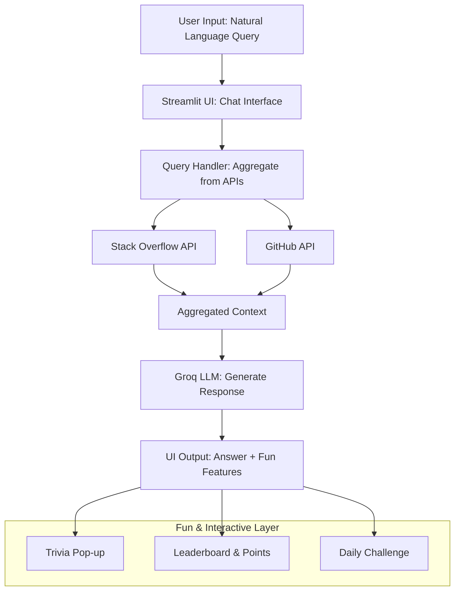
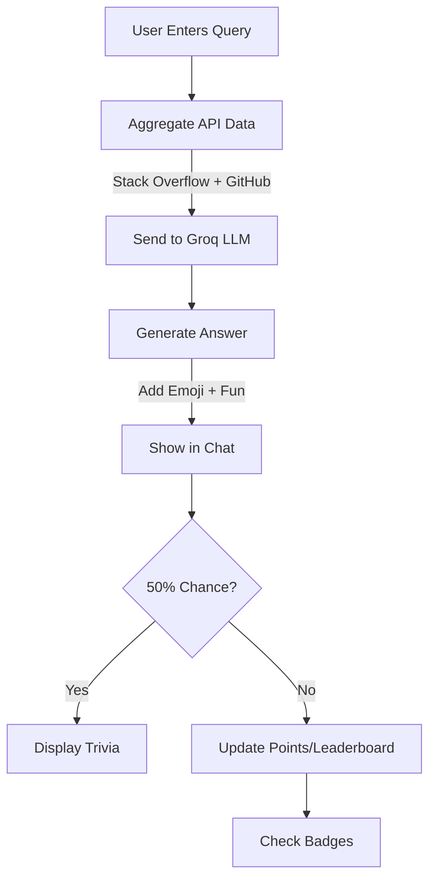

### Updated Curated Documentation with Diagrams and GitHub Repo Setup

Absolutely, I'd be happy to expand the documentation! Based on your request, I've refined the previous version to include:

- **Diagrams:** Since this is a text-based response, I can't generate or attach actual image files (like PNGs), but I've incorporated simple, renderable diagrams using Markdown-compatible Mermaid syntax. You can paste this into tools like GitHub, Obsidian, or Markdown viewers (e.g., Typora) to visualize them interactively. I've added a high-level architecture diagram and a flowchart for the query process.
- **GitHub Repo Setup:** I've added a new section with step-by-step instructions to create and set up a GitHub repository for this project. This includes sharing tips, as you mentioned wanting to share with someone. Note: I can't create the repo for you (as an AI, I don't have access to your GitHub account), but these steps are straightforward and based on current best practices as of July 29, 2025.

The rest of the documentation remains similar for consistency, with minor updates for clarity. As before, convert this Markdown to PDF/Word using tools like [Pandoc](https://pandoc.org) or [Markdown to PDF online converter](https://markdown-to-pdf.com).

If you need more advanced diagrams (e.g., via Draw.io exports) or help with actual repo creation, provide more details!

# Smart Knowledge Assistant Dashboard: Implementation Documentation

## Project Overview

**Concept:** An AI-powered dashboard for employees to query technical documentation, internal wikis, or public APIs (e.g., Stack Overflow, GitHub) using natural language. It uses a hosted LLM to interpret queries, aggregate information, and provide concise, interactive answers.

**Key Features:**

- Natural language querying with API aggregation.
- Fun elements: "Did You Know?" trivia pop-ups, a query leaderboard, gamification (points/badges), daily challenges, and an interactive chat mode.
- Hosted open-source LLM integration (via Groq API for fast, cloud-based inference without model downloads).

**Evolution from Conversation:**

- Started with Perplexity API.
- Switched to hosted open-source models (Together AI, then Groq for speed).
- Fixed errors (e.g., model deprecation).
- Added expanded trivia, gamification, and interactivity.

**Tech Stack:**

- Python 3.10+.
- Libraries: Streamlit (UI), Groq (LLM), Requests (APIs), Pandas (data), python-dotenv (secrets).
- Deployment: Local via Streamlit; scalable to cloud (e.g., Streamlit Cloud).

**Date Curated:** Tuesday, July 29, 2025.

## High-Level Architecture Diagram

Here's a Mermaid diagram showing the system's components and data flow. Copy this into a Mermaid-compatible viewer (e.g., [mermaid.live](https://mermaid.live)) to render it visually.



This diagram illustrates how user queries flow through API aggregation to the LLM, with fun features layered on top.

## Prerequisites

1. **Python Environment:**
    - Install Python 3.10+.
    - Create a virtual environment:

```
python -m venv knowledge_dashboard_env
source knowledge_dashboard_env/bin/activate  # macOS/Linux
# Windows: knowledge_dashboard_env\Scripts\activate
```

2. **Install Libraries:**

```
pip install streamlit requests python-dotenv pandas groq
```

3. **API Keys:**
    - **Groq API:** Sign up at [console.groq.com](https://console.groq.com) for a free key (includes credits).
    - **Stack Overflow API:** Optional key from [Stack Exchange API](https://api.stackexchange.com/docs).
    - **GitHub API:** Personal access token from [GitHub Settings](https://github.com/settings/tokens).
    - Create a `.env` file in the project root:

```
GROQ_API_KEY=your_groq_key_here
STACK_OVERFLOW_KEY=your_stack_key_here (optional)
GITHUB_TOKEN=your_github_token_here
```

4. **Additional Tools (Optional):**
    - For internal docs: Install `PyPDF2` via `pip install pypdf2` to parse uploaded files.
    - For diagrams: Use [Draw.io](https://app.diagrams.net) or Mermaid for custom visuals.

## Step-by-Step Implementation

### Step 1: Set Up Project Structure

- Create two files: `query_handler.py` (for API logic) and `app.py` (for Streamlit UI).
- Place the `.env` file in the root.


### Step 2: Implement Query Handling (query_handler.py)

This module handles LLM queries via Groq, aggregates data from Stack Overflow and GitHub, and synthesizes responses.

```python
import requests
import os
from dotenv import load_dotenv
from groq import Groq

load_dotenv()

GROQ_API_KEY = os.getenv('GROQ_API_KEY')
client = Groq(api_key=GROQ_API_KEY)

def query_groq(user_query, system_prompt="You are a helpful assistant that aggregates info from tech docs and APIs."):
    response = client.chat.completions.create(
        model="llama-3.3-70b-versatile",  # Stable, hosted open-source model
        messages=[
            {"role": "system", "content": system_prompt},
            {"role": "user", "content": user_query}
        ],
        max_tokens=512,
        temperature=0.7
    )
    return response.choices[0].message.content

STACK_OVERFLOW_ENDPOINT = 'https://api.stackexchange.com/2.3/search/advanced'
GITHUB_ENDPOINT = 'https://api.github.com/search/repositories'

def fetch_stack_overflow(query, api_key=None):
    params = {
        'order': 'desc',
        'sort': 'relevance',
        'q': query,
        'site': 'stackoverflow',
        'key': api_key if api_key else None
    }
    response = requests.get(STACK_OVERFLOW_ENDPOINT, params=params)
    if response.status_code == 200:
        items = response.json().get('items', [])
        return [item['title'] + ": " + item['link'] for item in items[:3]]
    return []

def fetch_github(query, token):
    headers = {'Authorization': f'token {token}'}
    params = {'q': query, 'sort': 'stars', 'order': 'desc'}
    response = requests.get(GITHUB_ENDPOINT, params=params, headers=headers)
    if response.status_code == 200:
        items = response.json().get('items', [])
        return [item['full_name'] + ": " + item['html_url'] for item in items[:3]]
    return []

def aggregate_and_query(user_query):
    stack_results = fetch_stack_overflow(user_query, os.getenv('STACK_OVERFLOW_KEY'))
    github_results = fetch_github(user_query, os.getenv('GITHUB_TOKEN'))
    aggregated_context = f"Stack Overflow results: {stack_results}\nGitHub results: {github_results}"
    full_query = f"{user_query}\nContext: {aggregated_context}"
    return query_groq(full_query, "Summarize and present concise answers based on the provided context.")
```


### Step 3: Build the Interactive Dashboard (app.py)

This creates the UI with chat mode, trivia, leaderboard, gamification, and daily challenges.

```python
import streamlit as st
import pandas as pd
from query_handler import aggregate_and_query
import random
import datetime

# Expanded trivia list
TRIVIA = [
    "Did you know? The first computer bug was a moth found in a Harvard Mark II computer in 1947.",
    "Python was named after Monty Python, not the snake!",
    "Did you know? The QWERTY keyboard layout was designed in the 1870s to prevent typewriter keys from jamming, not for typing efficiency.",
    "Did you know? The term 'spam' for unwanted emails comes from a 1970 Monty Python sketch about the canned meat.",
    "Did you know? The first email was sent by Ray Tomlinson in 1971, and it was something like 'QWERTYUIOP'.",
    "Did you know? The world's first website, created by Tim Berners-Lee in 1991, explained what the World Wide Web was.",
    "Did you know? Ada Lovelace wrote the first computer program in the 1840s for Charles Babbage's Analytical Engine.",
    "Did you know? The '@' symbol in email addresses was chosen because it meant 'at' in accounting ledgers.",
    "Did you know? The first computer mouse was invented in 1964 and was made of wood.",
    "Did you know? Wi-Fi doesn't stand for anything—it's a made-up term, not 'Wireless Fidelity'.",
    "Did you know? The first video game, Tennis for Two, was created in 1958 on an oscilloscope.",
    "Did you know? The hashtag symbol (#) was originally called an 'octothorpe' by Bell Labs engineers."
]

# Leaderboard (CSV storage)
LEADERBOARD_FILE = 'leaderboard.csv'

def load_leaderboard():
    try:
        return pd.read_csv(LEADERBOARD_FILE)
    except FileNotFoundError:
        return pd.DataFrame(columns=['Query', 'Creativity Score'])

def save_leaderboard(df):
    df.to_csv(LEADERBOARD_FILE, index=False)

# Initialize session state
if 'messages' not in st.session_state:
    st.session_state.messages = []
if 'points' not in st.session_state:
    st.session_state.points = 0
if 'badges' not in st.session_state:
    st.session_state.badges = []

st.title("Smart Knowledge Assistant Dashboard")

# Daily Challenge
today = datetime.date.today()
challenge = "Today's Challenge: Ask about a Python best practice from GitHub!"
st.subheader(challenge)

# Interactive Chat Input
prompt = st.chat_input("Ask a question about tech docs, wikis, or APIs:")
if prompt:
    st.session_state.messages.append({"role": "user", "content": prompt})
    response = aggregate_and_query(prompt)
    st.session_state.messages.append({"role": "assistant", "content": response + " 😊"})
    
    # Gamification: Award points
    st.session_state.points += 10
    if st.session_state.points >= 50 and "Query Enthusiast" not in st.session_state.badges:
        st.session_state.badges.append("Query Enthusiast")
        st.success("Badge Unlocked: Query Enthusiast!")
    
    # Fun: Did You Know? (50% chance)
    if random.choice([True, False]):
        st.info(random.choice(TRIVIA))
    
    # Leaderboard Update
    creativity_score = len(prompt.split()) + random.randint(1, 10)
    df = load_leaderboard()
    new_entry = pd.DataFrame({'Query': [prompt], 'Creativity Score': [creativity_score]})
    df = pd.concat([df, new_entry]).sort_values('Creativity Score', ascending=False).head(10)
    save_leaderboard(df)

# Display Chat History
for msg in st.session_state.messages:
    with st.chat_message(msg["role"]):
        st.write(msg["content"])

# Sidebar for Points, Badges, and Leaderboard
with st.sidebar:
    st.header("Your Stats")
    st.write(f"Points: {st.session_state.points}")
    st.write("Badges:")
    for badge in st.session_state.badges:
        st.write(f"- {badge}")
    st.subheader("Query Leaderboard")
    st.table(load_leaderboard())

# Note: For internal wikis/docs, add file upload and parse (e.g., via PyPDF2), then include in context.
```


## Query Process Flowchart

A simple flowchart for how queries are processed. Render in Mermaid viewers.




## Step 4: Run and Test

- Command: `streamlit run app.py`.
- Access: Open `localhost:8501` in your browser.
- Test Query: "Python REST API tips" – Expect aggregated response, trivia, points, and leaderboard update.
- Debugging: Check Groq console for quotas; add try-except for API errors.


## Step 5: Set Up a GitHub Repository for Sharing

To share this project easily, create a GitHub repo. This allows collaboration, version control, and easy distribution (e.g., via a repo link). Here's how as of July 29, 2025:

1. **Create the Repo:**
    - Go to [github.com](https://github.com) and log in.
    - Click "New" (green button) in the top right.
    - Name it (e.g., "smart-knowledge-dashboard").
    - Add a description: "AI-powered dashboard for querying tech docs with fun features."
    - Set to Public (or Private if sensitive).
    - Check "Add a README file" and ".gitignore" (select Python template).
    - Click "Create repository."
2. **Add Project Files:**
    - On your local machine, initialize Git in your project folder:

```
git init
git add query_handler.py app.py .env.example  # Create .env.example without real keys
git commit -m "Initial commit: Dashboard implementation"
```

    - Link to remote: `git remote add origin https://github.com/yourusername/smart-knowledge-dashboard.git`
    - Push: `git push -u origin main`
3. **Enhance for Sharing:**
    - Add this documentation as `README.md` or a separate `docs.md` file.
    - Include diagrams: Paste the Mermaid code into the README—it renders automatically on GitHub.
    - Add a license (e.g., MIT) via GitHub's "Add file" > "Create new file" named `LICENSE`.
    - For collaboration: Invite contributors via Settings > Collaborators.
    - Share the link: E.g., "Check out the project at https://github.com/yourusername/smart-knowledge-dashboard"
4. **Optional: Deploy via GitHub:**
    - Integrate with Streamlit Cloud: Connect your repo in [Streamlit Cloud](https://streamlit.io/cloud) for a live demo.
    - Add CI/CD: Create a `.github/workflows/deploy.yml` for automated testing.

This setup makes the project shareable in minutes—anyone can clone, run, or contribute.

## Step 6: Enhancements and Deployment

- **Internal Docs:** Add a file uploader in `app.py` and parse with PyPDF2 to include in queries.
- **Deployment:** Use [Streamlit Cloud](https://streamlit.io/cloud) or Heroku for team access.
- **Scaling:** Add user authentication (e.g., via Streamlit's secrets) for multi-user leaderboards.


## Additional Links and Resources

- **Groq API Docs:** [console.groq.com/docs](https://console.groq.com/docs) – For model details and deprecations.
- **Streamlit Documentation:** [docs.streamlit.io](https://docs.streamlit.io) – Tutorials on chat UI and session state.
- **Stack Overflow API:** [api.stackexchange.com/docs](https://api.stackexchange.com/docs) – Advanced search endpoints.
- **GitHub API:** [docs.github.com/en/rest](https://docs.github.com/en/rest) – Repository search guide.
- **Hosted LLM Alternatives:** [Together AI](https://docs.together.ai), [Hugging Face Inference](https://huggingface.co/docs/hub/inference-endpoints) – If switching from Groq.
- **Tech Trivia Sources:** [Computer History Museum](https://computerhistory.org), [Wikipedia: History of Computing](https://en.wikipedia.org/wiki/History_of_computing_hardware).
- **Project Inspiration:** [Perplexity AI Docs](https://docs.perplexity.ai) (original LLM used).
- **Diagram Tools:** [Mermaid Live Editor](https://mermaid.live), [Draw.io](https://app.diagrams.net) for exporting images.
- **GitHub Guides:** [Creating a Repo](https://docs.github.com/en/repositories/creating-and-managing-repositories/creating-a-new-repository), [Git Basics](https://git-scm.com/docs/gittutorial).

This documentation is comprehensive yet concise for sharing. For customizations, contact the curator (Perplexity AI).

